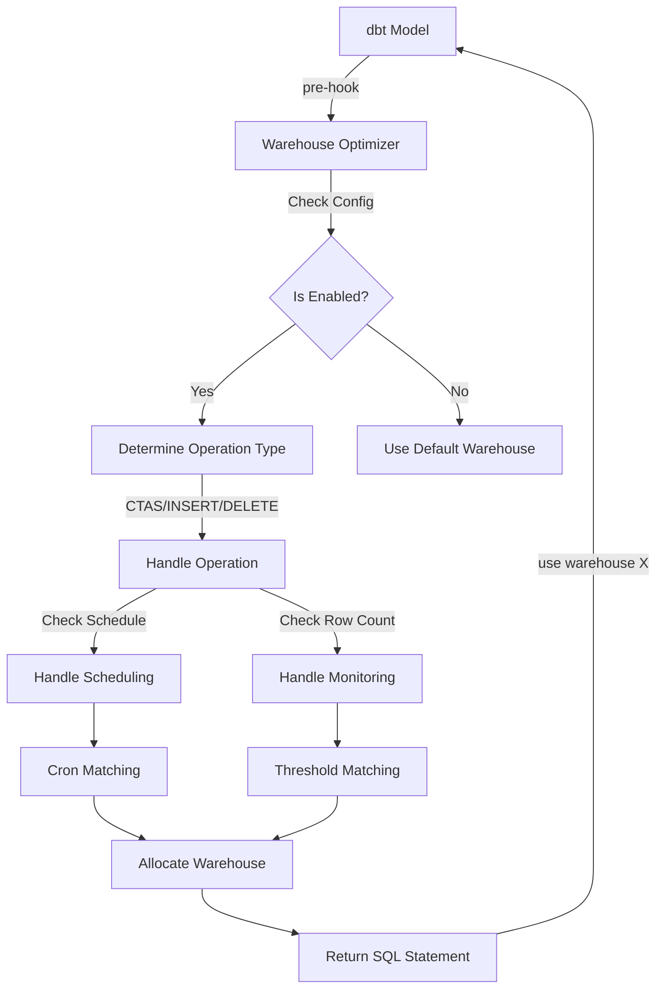
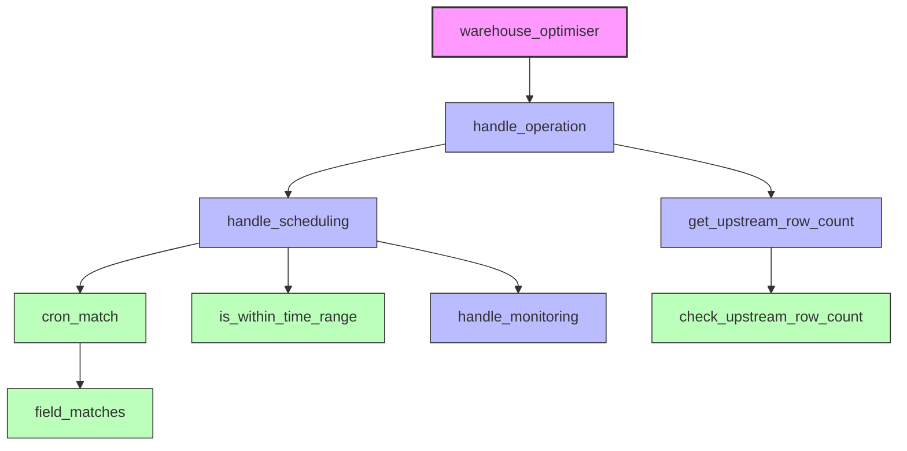
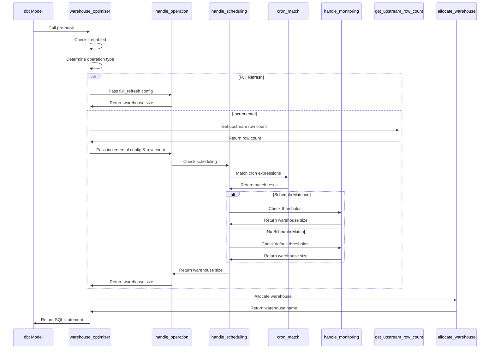
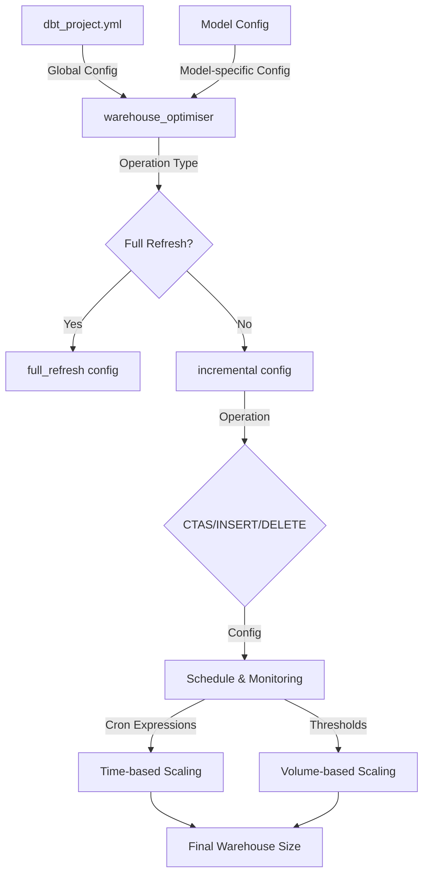

# Warehouse Optimizer Architecture

This document provides a comprehensive overview of the Warehouse Optimizer architecture, including component relationships and process flows.

## High-Level Architecture

The Warehouse Optimizer is a dbt pre-hook that dynamically adjusts the warehouse size based on the operation type, schedule, and data volume.

## Component Architecture

The Warehouse Optimizer is composed of several macros, each with a specific responsibility:

## Macro Responsibilities

| Macro | Description |
|-------|-------------|
| `warehouse_optimiser` | Main entry point that validates configuration and determines operation type |
| `handle_operation` | Processes the operation type (CTAS, INSERT, DELETE) and determines warehouse size |
| `handle_scheduling` | Checks if current time matches any configured schedules |
| `handle_monitoring` | Checks if row count exceeds any configured thresholds |
| `cron_match` | Determines if current time matches a cron expression |
| `field_matches` | Helper for cron matching to check individual cron fields |
| `get_upstream_row_count` | Gets row count from upstream dependencies |
| `check_upstream_row_count` | Executes query to count rows in a specific relation |
| `is_within_time_range` | Legacy helper for time-based scheduling |

## Process Flow

The following diagram shows the detailed process flow for the Warehouse Optimizer:

## Configuration Flow

This diagram shows how configuration is processed:

## Simplified Implementation

The implementation has been simplified to:

1. Reduce code complexity and redundancy
2. Establish clear boundaries between macros
3. Simplify logging
4. Make the code more maintainable
5. Improve readability

Key improvements include:

- Consolidated cron matching into a single, efficient macro
- Simplified parameter passing between macros
- Reduced logging verbosity
- Improved error handling
- Better handling of time ranges in cron expressions 